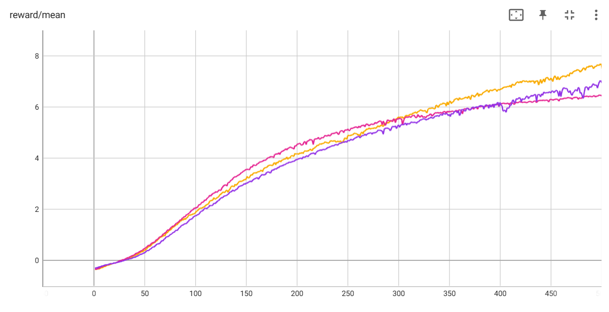

# Gymnasium-RL

This repository contains AI‑Capstone Project 2 code for:
- **PPO** on continuous‑control Mujoco environments (Humanoid, HalfCheetah, Walker2d, Ant)
- **Double DQN** on the Atari game BeamRider‑v5
## Result
    

## Repository Structure
```
Gymnasium-RL/
├── vedios/           # Store the playing vedio
├── logs/             # Store training logs for tensorboard
├── checkpoints/      # Store checkpoint models
├── train_PPO.py      # Main script for PPO
├── train_DDQN.py     # Main script for DDQN
└── requirements.txt  # Dependencies
```
## Setup

Install dependencies:
```
pip install -r requirements.txt
pip install gymnasium[atari] ale-py
pip install gymnasium[mujoco]
```
## Usage

### Train PPO Agent
You can customize the training by modifying the command-line arguments:

- `--envs`: Gymnasium Mujoco environments (default: HalfCheetah-v5).
- `--n-envs`: Number of environments to run in parallel (default: 32).
- `--n-epochs`: Epochs to train the model (default: 3000).
- `--render-epoch`: Render every n epochs (default: 25).

For example:

```bash
python train_PPO.py --env Ant-v5
```
Checkpoints, videos and logs will be saved under `checkpoints/` , `videos/` and `logs/`.
### Train DDQN Agent (BeamRider‑v5)
Train DDQN Agent. For BeamRider‑v5 in Atari environment
```
python train_DDQN.py
```
Checkpoints, videos and logs will be saved under `checkpoints/` , `videos/` and `logs/`.
### Monitor Training Progress
You can monitor the training progress by viewing the videos in the `videos/` folder or by looking at the graphs in TensorBoard:
```
tensorboard --logdir "logs"
```
## Experiments
### 1. DQN vs. Double DQN

Compared standard DQN and Double DQN on the Atari BeamRider‑v5 environment. All results are computed over the **last 200 episodes** of training.  

  

*Colors: pink – DDQN, blue – DQN.*  

| Method | Mean Reward         | Std Dev | Max Reward        | Min Reward        |
|:-------|--------------------:|--------:|------------------:|------------------:|
| DQN    | 1806.51            | 860.73  | 5602             | 528               |
| DDQN   | 2169.88(+20.1%)  | 928.62  | 5404(-3.5%)    | 616(+16.7%)     |


**Conclusion:** Double DQN increases mean reward by **20.1 %** and raises the worst‐case score by **16.7 %**, at the cost of a slightly lower peak.  

---

### 2. PPO Network Capacity Ablation

We tested three network sizes (small, baseline, large) to see how MLP capacity influences PPO’s learning under a 500‑epoch budget.

  

*Colors: orange – Small, purple – Baseline, pink – Large.*  

| Configuration | Final Mean Return    | Std Dev | Epoch to 80 % Baseline |
|:-------------:|---------------------:|--------:|:----------------------:|
| Small         | 7.61 (+10.3 %)       | 0.0535  | 297 (−8.3 %)           |
| Baseline      | 6.90                  | 0.0856  | 324                     |
| Large         | 6.44 (−6.7 %)        | 0.0235  | 295 (−8.9 %)           |


**Conclusion:** The small network achieved a **10.3 %** higher final return and hit the 80 % threshold **8.3 %** faster than the baseline.
